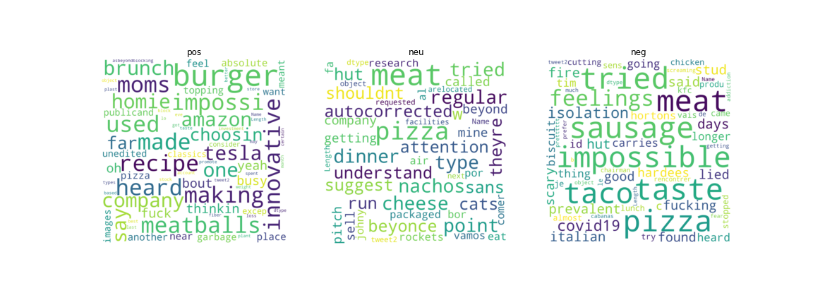

# Stock analysis 
updated on 12/11/2020

## Abstract
This project analyzes the Beyond Meat (BYND) company in the perspective of social media sentiment and stock prices. Please feel free to use the shared methods for analyzing other comapnies. 
On Twitter, the overall sentiment toward the company and its products are positive. In terms of stock prices, most of the models predicts it will continue to go down.

## 1. Introduction
Beyond Meat (BYND) is a Los Angeles-based producer of plant-based meat substitutes. This company caught my attention due to its innovative researches and its sustainability efforts. Thus, I would like to know more about the company from the data perspective and check if there is any potential for investment.
The project consists of two major parts. The first part is sentiment analysis on social media, specifically Twitter. The second part is stock price analysis. For stock price, I checked its correlation with its public financial statistics, Google search trend and COVID cases. In addition, I trained supervised regression models for price prediction.

## 2. Methodology
### 2.1. Sentiment Analysis
#### 2.1.1 Twitter Scraping
I scrapped related tweets from Twitter using keyword ‘beyond meat’ and python library snscrape. Pupular python libraries like Tweepy and GetOldTweets3 are recently blocked from Twitter. Snscrape is a recently developed library and I am not sure if it will be blocked during your evaluation. Without a premium Twitter developer account, I can only fetch a sample set of the data. I run the scrapper almost everyday to fetch new sample tweets. For each record, I only saved the user_id, date and tweet. The related output file is ‘place_result.csv’.
#### 2.1.2 Data Preprocessing
On row-level, I removed the duplicated rows and the additional title rows inserted into the csv caused by me running the scraper multiple times. The number of rows dropped from 48843 to 15756 after these steps. On the column-level, I created new attribute ‘quarter’ and ‘month’, and they are both derived from ‘date’.
For tweet cleaning, I first replaced all the emoji to text, using library demoji. Since I found that some of the emoji text are misleading and insufficient to describe sentiment, I manually converted them one-by-one. For example, I converted 😍  from ‘hearteyes’ to ‘like’, and removed 😭 because it often represents touching instead of crying in the dataset. Then, I converted all the text to lowercase. Lastly, I removed weblinks, ‘beyond meat’, stop words and symbols from the text.
   
#### 2.1.3 Sentiment analysis
Using nltk library, I obtained the sentiment score for the concatenated tweets for each month. Using word cloud, I can displays the frequent words appeared related with Beyond meat for each month and for each type of sentiment (positive, neutral and negative)

## 2.2. Price Analysis
### 2.2.1 Data Obtaining and preprocessing
Data used (related file):
1. Financial statistics: I copied from Yahoo Finance BYND statistics [1] to an excel spread
sheet and manually cleaned the table. (‘financial_statistics.csv’)
2. Stock prices: I directly downloaded from Yahoo finance BYND historical data [2] from
05/03/2019 (BYND’s Initial Public Offering date) to 12/11/2020. (‘BYND.csv’)
3. Google Trends potentially represents public interest toward the company. I downloaded from
BYND Google Trends [3] since 01/01/2019. (‘multiTimeline.csv’)
4. COVID Data. I discovered that the stock price is greatly affected by COVID during
algorithm development. Thus, in additional to the datasets proposed in the proposal, I
obtained the COVID data from the COVID Tracking Project [4]. (‘national-history.csv’)
In additional to general data cleaning and merging process, I also normalized all the data to the range of 0 to 1. I also removed the variables with low absolute correlation coefficients with the stock price (<0.1).
I created lag variables for stock price and the google search trend with t=60. For test period 2020-12-11 to 2021-01-11, the financial statistics are kept the same as the available statistic published at 2020-12-11, because they usually update quarterly. COVID data (new positive case) is imputed as the same as the most recent week data as it usually has a weekly pattern for example if the test date is Thursday, then it has the same number as the last available Thursday number from training data. Google Trend is imputed with LSTM1.
#### 2.2.2 Modeling
For predicting Google trend and stock prices, Long Short Term Memory network (LSTM1) is used with lagged features only. The network consist of two LSTM layers (output dimension (f) = 50). Then it follows by a dense layer (f = 25) and a final dense layer.
For stock price prediction, LSTM2 is used with both lagged stock prices and non-lagged features. For the lagged stock price input, the network performs the same two LSTM layers and a dense layer (f=10). For the non-lagged features, the network performs a dense layer (f=number of non-lagged features) with tanh activation, a dense layer (f=4). After combining the outputs from the two parts, a dense layer (f=5) a final dense layer are applied.
For stock price prediction, with both lagged stock price and non-lagged features, I also tested Linear regression, Lasso regression, SGD Regression and Bayesian Ridge regression.
## 3 Results
### 3.1. Sentiment Analysis
Figure 1 shows the monthly numbers of tweets from 2020-01-01 to 2020-12-11 that I scrapped. There were much more discussion about the company on Twitter before the coronavirus outbreak. In November, the number of tweets increased significantly comparing to the past 5 months, potentially due to the recent collaboration announcements with major fast-food restaurants. For December tweets, it only include tweets up till 2020-12-11.  

After the sentiment score is calculated, score greater than 0.05 is classified as positive, score below -0.05 is classified as negative, and the rest are classified as neutral.
Based on the sentiment score displayed on Figure 2, we can see that both the average sentiment and the 75% percentile is the highest among the past 6 months. When looking at the percentage of sentiment class in Figure 3, there is a significant decrease in the percentage of positive. As I went through some of the sampled tweets from November, there was a significant increase in the amount of stock discussion, which potentially increased the percentage of neutral tweets. 

Figure 4 displays the word cloud for each sentiment class. The ‘burger’ and ‘meatball’ tends to have a positive comments. The ‘pizza’ and ‘sausage’ seems to have more negative comments. This may also imply the attitude difference toward Beyond Meat’s collaboration with Burger King and McDonald vs. Pizza Hut. Also, ‘amazon’, ‘tesla’ and ‘innovative’ appear on the positive side, implies that the market treats Beyond Meat as innovative as Tesla and Amazon. Word cloud for all of the tweets is displayed in Appendix 1. Word cloud for each quarter is displayed in Appendix 2.

### 3.2 Stock Price Analysis
Figure 5 shows the correlation coefficient of non-lagged variables with absolute coefficients greater than 0.5. Figure 6 shows the trends of stock price, Google search index and COVID positive increase. As demonstrated, search index and COVID cases have certain degree of correlation with the stock price. 

Prediction is made day by day, so that the each prediction will be used to update the related lagged variables for the future test days. All the prediction is evaluated on the unnormalized number which is converted back to its original scale. All the prediction results are illustrated in Figure 7.
For Google search trend prediction, the valid root mean squared error (RMSE) is 7.053 and the test prediction seems to be reasonable. The predicted search index for the test period is then used for LSTM2.
Stock price prediction performance for the evaluated models is shown in Table 1. Except LSTM1, all other models used both lagged features and non-lagged features. LASSO regression has the best performance, maybe because of its capability to ignore irrelevant variables. 

")

##  4 Conclusion
In conclusion, Beyond Meat’s products have a significant amount of positive comments in social media. Also, the market seems to treat it as an innovative stock. In terms of stock price, it tends to go up with its enterprise value and Google search trend. The stock price prediction is based on my best effort, however still far from perfect. At 2020-11-03, when I first tested the model, as illustrated in Figure 8, the predictions from LSTM2 were suggesting it might be close its ‘local minimum’. Even though other models suggested it may further plummet, I chose to believe my LSTM models have more reasonable predictions. Thus, I purchased 1 stock at that time just for fun. Fortunately, my models were at luck and I gained some money basing on the models.

## References
[1] “Beyond Meat, Inc. (BYND) Valuation Measures & Financial Statistics,” @YahooFinance, 2020. https://finance.yahoo.com/quote/BYND/key-statistics?p=BYND (accessed Dec. 11, 2020).
[2] “Beyond Meat, Inc. (BYND) Stock Historical Prices & Data - Yahoo Finance,” @YahooFinance, 2020. https://finance.yahoo.com/quote/BYND/history?p=BYND (accessed Dec. 11, 2020).
[3]Google Trends, “Google Trends,” Google Trends, 2015. https://trends.google.com/trends/explore?q=beyond%20meat&geo=US (accessed Dec. 11, 2020).
[4] “Data Download,” The COVID Tracking Project, 2020. https://covidtracking.com/data/download (accessed Dec. 11, 2020).
